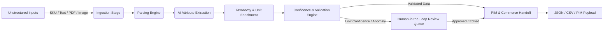

<div align="center">

# ⚡ Product Intelligence — Industrial Commerce
### *Enterprise AI-Powered Product Intelligence & Data Normalization Engine*

[](https://vitejs.dev/)
[](https://developer.mozilla.org/en-US/docs/Web/JavaScript)
[](https://vitest.dev/)
[](https://github.com/gunvant2005/AI_VENGERS)
[](LICENSE)

<br/>

[](https://vercel.com/new/clone?repository-url=https://github.com/gunvant2005/AI_VENGERS)
&nbsp;&nbsp;
[](https://app.netlify.com/start/deploy?repository=https://github.com/gunvant2005/AI_VENGERS)

</div>

---

## 📖 Overview

**Product Intelligence** is an enterprise-grade AI intelligence platform designed for industrial manufacturers, B2B distributors, and e-commerce catalogs. It ingests fragmented product inputs (SKUs, technical PDFs, spec sheets, supplier copy, and images) and normalizes them into **structured, evidence-linked, commerce-ready records**.

---

## 🌟 Key Platform Features

| Feature Module | Description & Capabilities |
|---|---|
| 📥 **Input Workspace** | Multi-modal ingestion of SKU codes, supplier text copy, technical PDF data sheets, and product images with instant preset loading. |
| ⚡ **6-Stage Pipeline Engine** | Asynchronous execution: `Ingestion` → `Parsing` → `Extraction` → `Enrichment` → `Validation` → `Human Review` → `Export`. |
| 🔍 **Evidence Traceability** | Every extracted attribute links directly to source document citations, page numbers, and exact text snippets. |
| 🛡️ **Validation & Anomaly Engine** | Real-time confidence scoring ($0-100\%$), missing attribute detection, unit standardization, and taxonomy checks. |
| 👥 **Human-in-the-Loop Review** | Inline attribute editing, single-click approvals/rejections, review notes, bulk operations, and multi-step undo (`Ctrl+Z`). |
| 🔐 **Role-Based Access Control** | Granular RBAC permissions for `Admin` (Full Access), `Reviewer` (Edit & Approve), and `Viewer` (Read-only). |
| 💾 **Auto-Save & Crash Recovery** | Continuous `localStorage` snapshotting with 1-click state backup export and restore. |
| 📦 **Multi-Format Handoff** | One-click export and clipboard copy for **Full JSON**, **CSV Flat File**, and **PIM-ready JSON**. |

---

## 🏗️ System Architecture



---

## 🔒 Security & Compliance Matrix

- 🛡️ **XSS Sanitization**: Dynamic HTML escaping (`sanitizeInput()`) on all client rendering.
- 🛡️ **SQLi / Injection Guard**: Query pattern filter (`sanitizeSqlInjection()`) stripping malicious command injections.
- 🛡️ **Content Security Policy**: Meta CSP restricting script origins, font sources, and connect endpoints.
- 🛡️ **File Payload Security**: MIME type & extension whitelisting (`.pdf`, `.png`, `.jpg`, `.webp`) with a strict 10MB limit.
- 🛡️ **Rate Limiting**: Request throttling (`pipelineRateLimiter`, max 5 requests / 10 sec window).
- 🛡️ **Authentication & RBAC**: Session permission guards preventing Unauthorized/Viewer role modifications.

---

## 🚀 Quick Start Guide

### Prerequisites
- **Node.js** v18+ 
- **npm** v9+

### Installation & Local Setup

```bash
# 1. Clone repository
git clone https://github.com/gunvant2005/AI_VENGERS.git
cd AI_VENGERS

# 2. Install dependencies
npm install

# 3. Start local development server
npm run dev

# 4. Run Vitest automated test suite
npm run test

# 5. Build for production
npm run build
```

Open your browser at `http://localhost:5173`.

---

## 🧪 Automated Testing Suite

Configured with **Vitest** ([vite.config.js](vite.config.js)) for high reliability:

```bash
npm run test
```

### 5 Test Coverage Modules:
1. `src/__tests__/pipeline.test.js` — Pipeline engine & fallback SKU generator
2. `src/__tests__/validation.test.js` — Validation rules & anomaly detection engine
3. `src/__tests__/export.test.js` — Full JSON, CSV, and PIM format builders
4. `src/__tests__/security.test.js` — XSS escaping, file upload bounds, and rate limiting
5. `src/__tests__/auth.test.js` — RBAC permissions, role switching, and SQL/password validators

---

## ⌨️ UX Keyboard Shortcuts

| Shortcut | Action |
|---|---|
| `Ctrl` + `Enter` | Submit Input Form / Approve Active Review Item |
| `Ctrl` + `S` | Quick Export Full Product JSON Record |
| `Ctrl` + `Z` | Undo Last Review Queue Action |
| `Esc` | Cancel Inline Attribute Editing |

---

## 📄 Documentation Links

- 📘 [API Specification & Schemas](API_DOCUMENTATION.md)
- 💾 [Disaster Recovery & Backup SOP](BACKUP_RECOVERY.md)
- 📊 [13-Point Quality & Audit Report](C:\Users\dhake\.gemini\antigravity-ide\brain\04982c0f-3423-47a6-a8a3-fb7d3174db0e\audit_report.md)

---

<div align="center">

Made with ❤️ by **Team AI_VENGERS**  
*Licensed under the [MIT License](LICENSE)*

</div>
